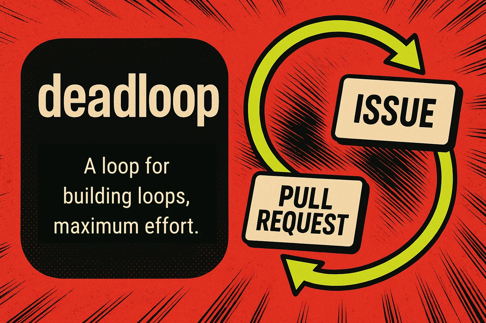

English | [日本語](README.ja.md)

# deadloop

> A loop for building loops, maximum effort.

**GitHub Issues in, reviewed PRs out.** deadloop watches Issues and automates implementation, pull requests, review, and merge—with safety controls built in.

## Install

```bash
npx skills@latest add yasuhito/deadloop
```

## Current status

- v0 is a Pi package / extension.
- The default runner is [Herdr](https://herdr.dev/).

## Configure

To start with the defaults, create `deadloop.json` at the target repository root and commit it to the base branch:

```json
{}
```

deadloop infers the local checkout path, GitHub repository, base branch, and default Herdr worktree root from the current Git repository. The first run needs no local configuration.

Copy the example into Pi's local state only when you need overrides such as `autoMerge` or a custom `worktreeRoot`:

```bash
mkdir -p ~/.pi/agent/deadloop
cp ~/.pi/agent/git/github.com/yasuhito/deadloop/extensions/deadloop/projects.example.json ~/.pi/agent/deadloop/projects.json
$EDITOR ~/.pi/agent/deadloop/projects.json
```

`projects.json` contains local paths and rollout choices. Do not commit it. See the [setup guide](docs/public-package-setup.md) for every available setting.

## Safety controls

`autoMerge` controls whether deadloop merges reviewed PRs automatically.

With `false`, deadloop creates and reviews each PR, then hands the merge to a human. With `true`, deadloop squash-merges PRs that pass its safety checks and deletes their head branches.

Start with `false`. Enable `true` only after verifying branch protection, CI, permissions, and stop conditions.

## Create labels

Create the standard labels once per repository:

```bash
gh label create ready-for-agent --repo owner/repo --color 0e8a16 || true
gh label create agent:implement --repo owner/repo --color 1d76db || true
gh label create agent:in-progress --repo owner/repo --color fbca04 || true
gh label create agent:review --repo owner/repo --color 5319e7 || true
gh label create agent:reviewing --repo owner/repo --color c2e0c6 || true
gh label create agent:blocked --repo owner/repo --color b60205 || true
gh label create ready-for-human --repo owner/repo --color d93f0b || true
gh label create needs-info --repo owner/repo --color fef2c0 || true
gh label create needs-triage --repo owner/repo --color f9d0c4 || true
```

An issue is eligible only when it has both `ready-for-agent` and `agent:implement`.

## Merge-conflict recovery

When a selected same-repository PR conflicts with the configured base, deadloop can start one guarded branch-update worker. It merges the selected base commit into the existing PR branch (never rebases), runs the configured checks, re-checks the PR head immediately before a non-force push, and then returns the PR to normal review. Review labels remain in place during the update; no extra label is required.

Each exact PR-head/base-head pair is attempted at most once. A stale PR head stops without pushing and is re-evaluated on the next cycle. Failed or unsafe updates are marked `agent:blocked` with recovery evidence. See [ADR 0011](docs/adr/0011-pr-merge-conflict-recovery.md) for the safety contract.

## Automatic review repair

When the built-in reviewer reports structured actionable findings, deadloop can start one bounded repair worker on the existing PR branch. Review labels stay in place; no repair label is added. The worker receives only the findings, runs configured checks, re-checks the PR head immediately before a normal push to that exact branch, and never force-pushes or changes GitHub workflow state.

A changed head starts a fresh review cycle. A stale head stops without pushing or changing labels. Repeated findings after the bounded attempt, a required human decision, or an exhausted technical/safety retry adds `agent:blocked` with recovery guidance. See [ADR 0012](docs/adr/0012-automatic-pr-review-repair.md).

## Roll out in phases

1. **Issue coordination only** — start here if you want a slow rollout; humans still review and merge PRs.
2. **Automated PR review** — use the standard PR reviewer with `autoMerge: false`; reviewed PRs hand off to `ready-for-human`. External review requests stay off unless `externalReview.enabled` is true.
3. **Optional auto-merge** — consider `autoMerge: true` only after branch protection, CI, review expectations, dry-run/manual approval practices, and stop conditions are proven.

## Run

Start Pi inside the target repository:

```bash
cd /absolute/path/to/target/repo
pi
```

Useful commands:

```text
/deadloop-status
/deadloop-doctor
```

Operator environment variables:

```bash
DEADLOOP_CONFIG=/path/to/projects.json pi
DEADLOOP_PROJECTS=my-project pi
DEADLOOP=off pi
DEADLOOP_AUTOMATIONS=off pi
DEADLOOP_DEBUG=1 pi
```

## Documentation

- Setup guide: [docs/public-package-setup.md](docs/public-package-setup.md)
- Herdr runner details: [docs/herdr-runner.md](docs/herdr-runner.md)

## Verify this repository

```bash
npm test
npm run lint
npm run typecheck
bash -n extensions/deadloop/automations/*.sh
npm pack --dry-run
```
